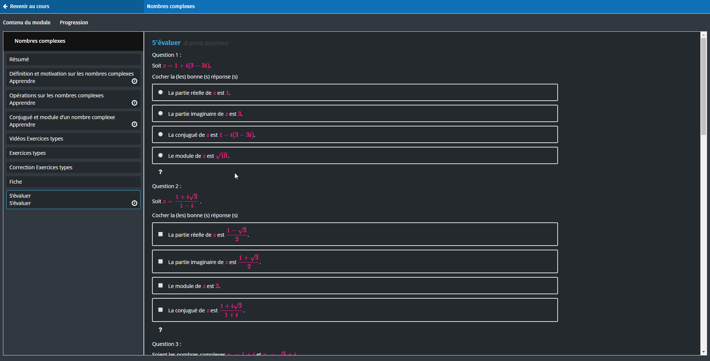
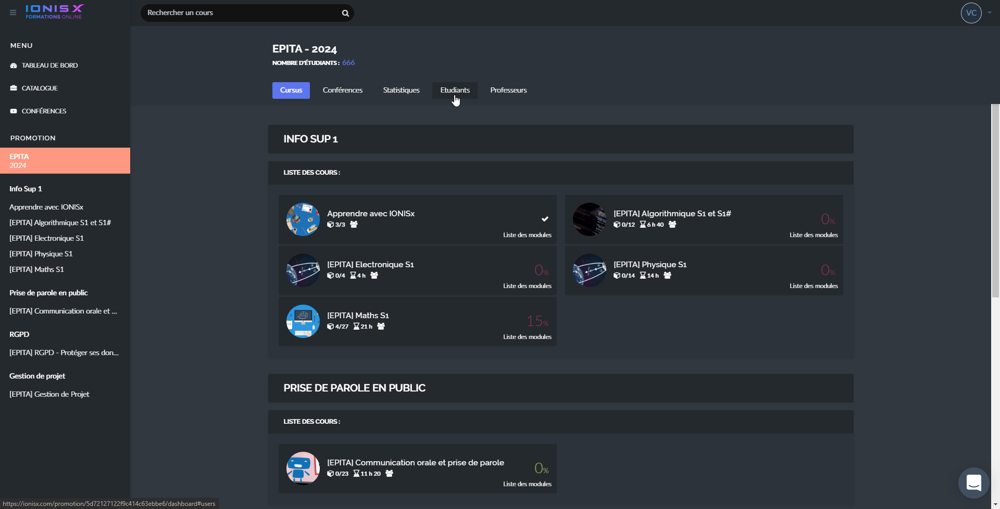

    

### Download

|  Chrome |  Firefox |
| ----------------------------------------------------------------------------------------------------------------------------------------------------------------------------------------------------------------- | ------------------------------------------------------------------------------------------------------------------------------------------------------------------------------------------------------------- |
| [Download for Chrome](https://chrome.google.com/webstore/detail/xsinoi/locnpgnaihgbgdppfdejejjckanaedcm)                                                                                                          | [Download for Firefox](https://addons.mozilla.org/fr/firefox/addon/xsinoi/)                                                                                                                                |

> For manual installation, see [Manual installation guide](https://github.com/Vinetos/Xsinoi#chrome-)

# Xsinoi
A dark theme with automatic update for IonisX courses.  
_**We are not affiliated with the ionis group.**_

  

# Screenshots

  

  

# How to install (Manual)
## Chrome :
1. [Download the project](https://github.com/Vinetos/Xsinoi/archive/master.zip) or clone the project and extract it.  
2. Navigate to `chrome://extensions/` and click on `Load unpacked extension`.   
3. Select the root folder
4. Modify the extension as you wish and reload it by clicking on the reload button.  
5. Enjoy !

## Firefox :	
1. [Download the project](https://github.com/Vinetos/Xsinoi/archive/master.zip) or clone the project and extract it.  	
2. Navigate to `about:debugging`. Go the `This firefox` and click on `Load temporary extension`.   	
3. Select the root folder  
4. Modify the extension as you wish  
5. Enjoy !  
> Note: This works until you restart your browser
