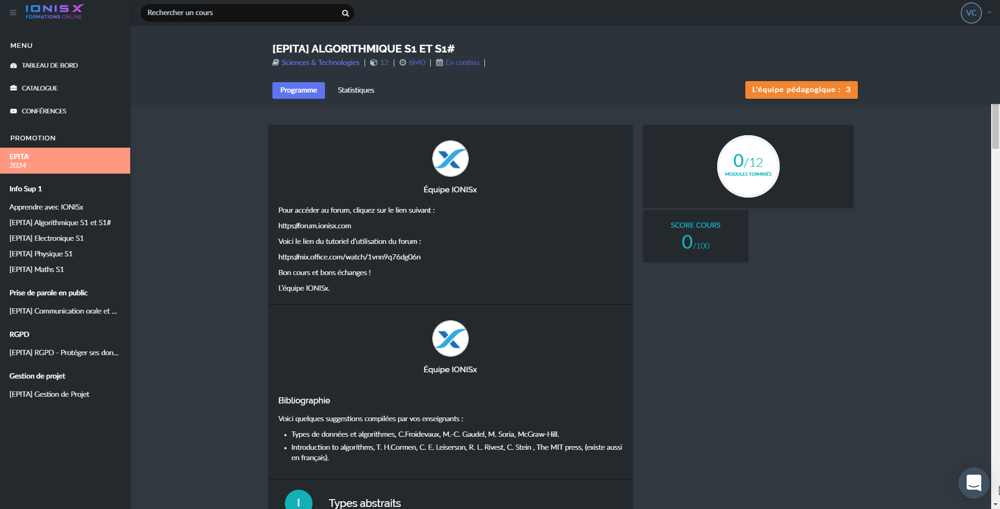
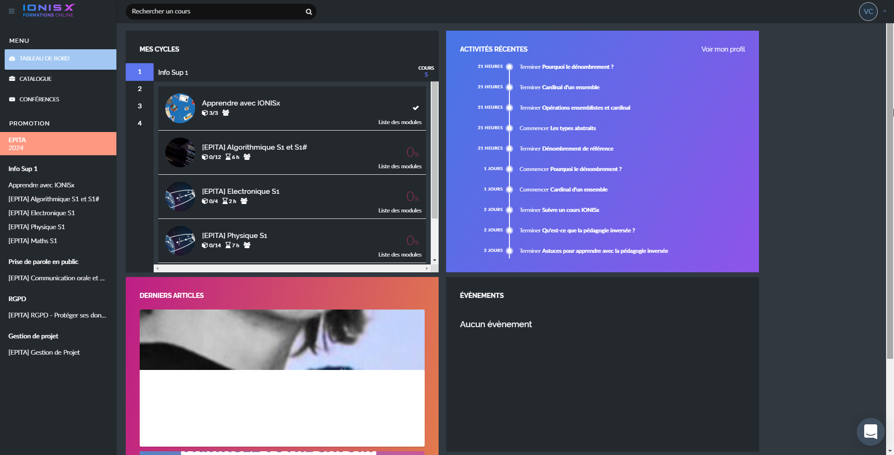
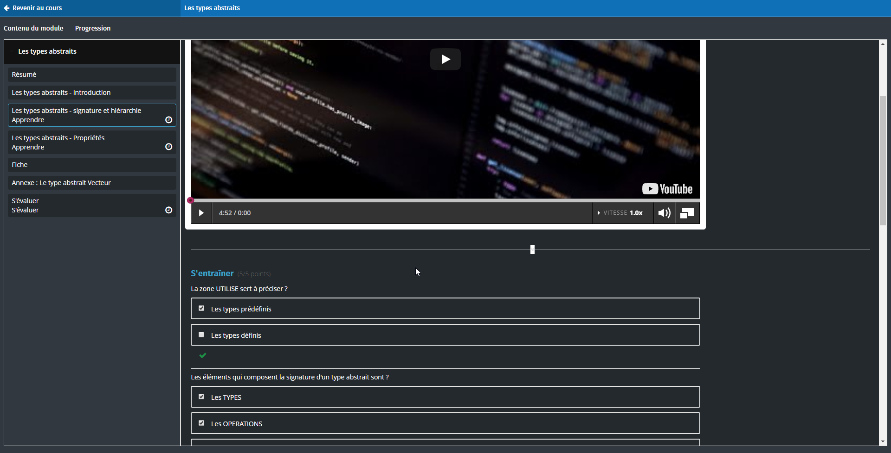

# Xsinoi
A dark theme with automatic update for IonisX courses.

  

# How to install ? 
## Chrome :
1. [Download the project](https://github.com/Vinetos/Xsinoi/archive/master.zip) and extract it.  
2. Navigate to `chrome://extensions/` and click on `Load unpacked extension`.   
3. Select the root folder and enjoy !

## Firefox :
1. [Download the project](https://github.com/Vinetos/Xsinoi/archive/master.zip).  
2. Navigate to `about:debugging`. Go the `This firefox` and click on `Load temporary extension`.   
3. Select the root folder and enjoy !
> This works until you restart your browser

# Screenshots

  

